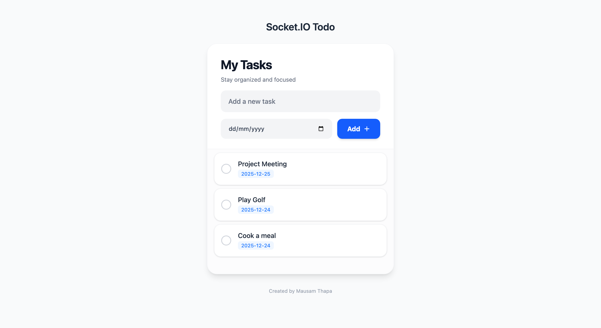

# Realtime Todo WebSocket App

A collaborative, real-time task management application. By utilizing WebSockets, this app ensures that any change—adding, deleting, or completing a task—is instantly synchronized across all connected users without a page refresh.

<div align="center">
  
  <p><em>(Replace the path above with your actual screenshot or GIF)</em></p>
</div>

---

## 🚀 Features

- **Instant Synchronization:** Real-time updates powered by WebSockets.
- **Multi-User Collaboration:** See changes made by others as they happen.
- **Dynamic UI:** Clean, responsive interface that works on all devices.
- **Status Tracking:** Mark tasks as complete or remove them instantly.

## 🛠️ Tech Stack

- **Frontend:** HTML5, CSS3, JavaScript (Vanilla)
- **Backend:** Node.js with Express
- **Real-time Engine:** [Socket.io / Native WebSockets]
- **Styling:** CSS Flexbox/Grid

## 📦 Installation & Local Setup

Follow these steps to get the project running on your local machine:

1. **Clone the repository:**
   ```bash
   git clone https://github.com/ThapaMausam/realtime-todo-websocket.git
   ```
